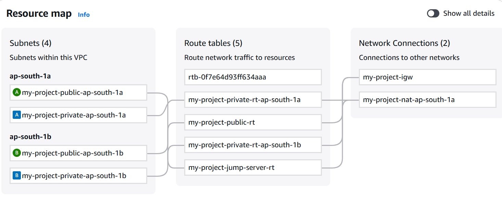
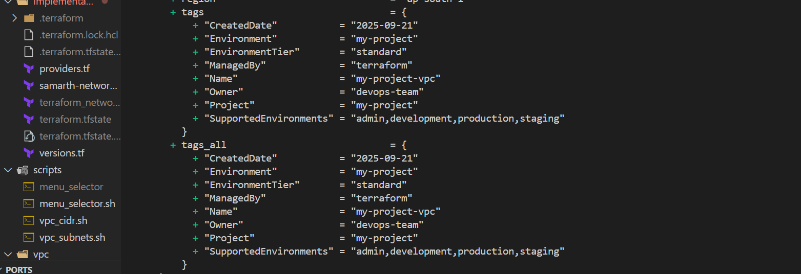
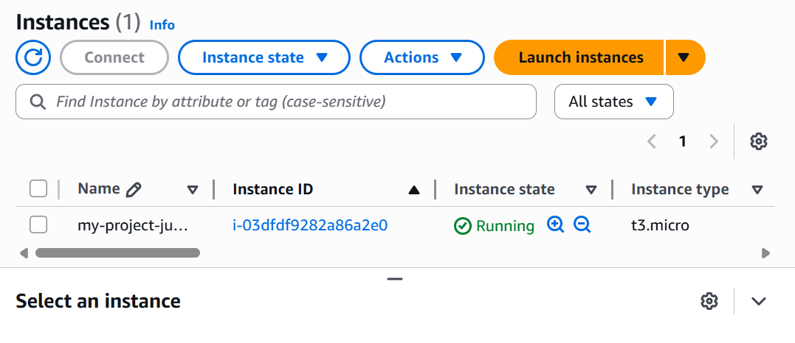

# AWS VPC Terraform Module with Interactive Configuration

[](https://opensource.org/licenses/MIT)
[](https://www.terraform.io/)
[](https://aws.amazon.com/)

A comprehensive, production-ready Terraform module for creating AWS VPC infrastructure with interactive configuration scripts and universal terminal compatibility.


*Complete VPC infrastructure with multi-tier subnets, NAT gateways, and security groups*

## 🚀 Features

### Core VPC Features
- **Complete VPC Management**: Create VPC with public, private, and database subnets
- **Multi-Environment Support**: Optimized configurations for admin, development, production, and staging environments
- **Smart NAT Gateway Options**: Single NAT, one per AZ, or customizable configurations
- **VPC Flow Logs**: Configurable logging with CloudWatch integration
- **Jump Server Support**: Optional bastion host for secure access
- **IPv6 Support**: Optional IPv6 CIDR blocks and dual-stack configurations
- **DNS Configuration**: Custom DHCP options and DNS resolution
- **Route53 Integration**: Private hosted zones and DNS management

### Advanced Networking
- **Security Groups**: Pre-configured security groups for different tiers
- **Network ACLs**: Optional network-level security controls
- **VPN Gateway**: Support for site-to-site VPN connections
- **Internet Gateway**: Automatic internet access for public subnets
- **Elastic IPs**: Managed EIP allocation for NAT gateways

### Interactive Configuration
- **Universal Menu Selector**: Cross-platform terminal menu system
- **CIDR Calculator**: Interactive subnet planning and validation
- **Configuration Wizard**: Guided setup for complex networking scenarios
- **Backup System**: Automatic configuration backups with versioning

## 📁 Project Structure

```
modules/
├── vpc/                          # Core Terraform module
│   ├── main.tf                   # Main VPC resources and logic
│   ├── variables.tf              # Input variables (343 lines)
│   ├── outputs.tf                # Output values (321 lines)
│   └── versions.tf               # Provider versions
├── scripts/                      # Interactive configuration scripts
│   ├── menu_selector.sh          # Universal menu system
│   ├── vpc_cidr.sh               # CIDR configuration wizard
│   ├── vpc_subnets.sh            # Subnet planning tool
│   └── menu_selector             # Compiled menu selector
├── implementation/               # Example implementation
│   ├── providers.tf              # AWS provider configuration
│   ├── samarth-network.tf        # VPC module usage example
│   ├── terraform_networks.tfvars # Configuration variables
│   └── versions.tf               # Terraform version constraints
├── imgs/                         # Documentation images
│   ├── resource_map.png          # VPC architecture diagram
│   ├── terraform_plan_sucess.png # Terraform execution example
│   └── jump_server.png           # Jump server configuration
├── backups/                      # Configuration backups
├── create_vpc.sh                 # Main configuration script
└── README.md                     # This documentation
```

## 📋 Prerequisites

### Required Software
- **Terraform** >= 1.0
- **AWS CLI** >= 2.0 (configured with appropriate credentials)
- **Bash** >= 4.0 (for scripts)
- **curl** (for downloading dependencies)

### AWS Permissions
Your AWS credentials need the following permissions:
- `ec2:*` (VPC, Subnet, Route Table, Internet Gateway, NAT Gateway)
- `logs:*` (for VPC Flow Logs)
- `iam:CreateRole`, `iam:AttachRolePolicy` (for Flow Logs role)
- `route53:*` (if using private hosted zones)

### Supported Platforms
- ✅ **Linux** (Ubuntu, CentOS, Amazon Linux)
- ✅ **macOS** (Terminal.app, iTerm2)
- ✅ **Windows** (WSL, Git Bash, MSYS2)
- ✅ **Cloud Shells** (AWS CloudShell, Azure Cloud Shell)

## 🛠️ Quick Start

### 1. Clone and Setup
```bash
git clone <your-repository-url>
cd Project-SetUp/modules
chmod +x create_vpc.sh scripts/*.sh
```

### 2. Interactive Configuration
```bash
./create_vpc.sh
```

### 3. Manual Configuration (Optional)
```bash
# Configure CIDR blocks
./scripts/vpc_cidr.sh

# Plan subnets
./scripts/vpc_subnets.sh
```

### 4. Deploy Infrastructure
```bash
cd implementation
terraform init
terraform plan -var-file="terraform_networks.tfvars"
terraform apply -var-file="terraform_networks.tfvars"
```


*Successful Terraform plan execution showing resource creation*

## 📚 Detailed Usage

### Environment-Specific Configurations

The module automatically optimizes settings based on the `project_name` variable:

#### Production Environment
```hcl
project_name = "production"
# Automatically enables:
# - VPC Flow Logs
# - Multiple NAT Gateways (high availability)
# - Enhanced monitoring
# - Stricter security groups
```

#### Development Environment
```hcl
project_name = "development"
# Automatically configures:
# - Single NAT Gateway (cost optimization)
# - Relaxed security for development
# - Basic monitoring
```

#### Admin Environment
```hcl
project_name = "admin"
# Special configuration with:
# - Jump server enabled by default
# - Full logging enabled
# - Administrative access patterns
```

### Core Module Usage

```hcl
module "vpc" {
  source = "../vpc"
  
  # Basic Configuration
  project_name = "my-project"
  vpc_name     = "my-project-vpc"
  vpc_cidr     = "10.0.0.0/16"
  
  # Subnet Configuration
  availability_zones = ["us-west-2a", "us-west-2b", "us-west-2c"]
  public_subnets     = ["10.0.1.0/24", "10.0.2.0/24", "10.0.3.0/24"]
  private_subnets    = ["10.0.11.0/24", "10.0.12.0/24", "10.0.13.0/24"]
  database_subnets   = ["10.0.21.0/24", "10.0.22.0/24", "10.0.23.0/24"]
  
  # NAT Gateway Configuration
  enable_nat_gateway     = true
  single_nat_gateway     = false  # One per AZ for HA
  one_nat_gateway_per_az = true
  
  # Monitoring and Logging
  enable_flow_logs                   = true
  flow_logs_destination_type         = "cloud-watch-logs"
  flow_logs_retention_in_days        = 30
  flow_logs_traffic_type             = "ALL"
  
  # Jump Server (Bastion Host)
  deploy_jump_server = true
  key_name          = "my-ec2-key-pair"
  
  # DNS Configuration
  enable_dns_hostnames = true
  enable_dns_support   = true
  
  # Tags
  tags = {
    Environment = "production"
    Project     = "my-project"
    ManagedBy   = "terraform"
  }
}
```

### Advanced Configuration Examples

#### Multi-Tier Application Setup
```hcl
# Web tier - public subnets
public_subnets = [
  "10.0.1.0/24",   # us-west-2a
  "10.0.2.0/24",   # us-west-2b
  "10.0.3.0/24"    # us-west-2c
]

# Application tier - private subnets
private_subnets = [
  "10.0.11.0/24",  # us-west-2a
  "10.0.12.0/24",  # us-west-2b
  "10.0.13.0/24"   # us-west-2c
]

# Database tier - isolated subnets
database_subnets = [
  "10.0.21.0/24",  # us-west-2a
  "10.0.22.0/24",  # us-west-2b
  "10.0.23.0/24"   # us-west-2c
]
```

#### IPv6 Dual-Stack Configuration
```hcl
enable_ipv6                     = true
assign_ipv6_address_on_creation = true
public_subnet_ipv6_prefixes     = [0, 1, 2]
private_subnet_ipv6_prefixes    = [3, 4, 5]
database_subnet_ipv6_prefixes   = [6, 7, 8]
```

#### VPN Gateway Integration
```hcl
enable_vpn_gateway = true
vpn_gateway_id     = "vgw-12345678"
propagate_private_route_tables_vgw  = true
propagate_public_route_tables_vgw   = true
```

## 🔧 Interactive Scripts

### Universal Menu Selector (`menu_selector.sh`)

A cross-platform terminal menu system with automatic environment detection:

**Features:**
- **Auto-detection**: Automatically detects terminal capabilities
- **Cross-platform**: Works on Linux, macOS, Windows (WSL/Git Bash)
- **Fallback modes**: Graceful degradation for limited terminals
- **Color support**: ANSI colors with tput fallbacks
- **Keyboard navigation**: Arrow keys, WASD, or numbered selection

**Usage:**
```bash
source scripts/menu_selector.sh

# Simple menu
menu_selector "Choose an option:" result "Option 1" "Option 2" "Option 3"
echo "Selected: $result"

# Advanced menu with custom return values
menu_selector "Select environment:" env \
    "Development Environment" "Staging Environment" "Production Environment" \
    -- \
    "dev" "staging" "prod"
```

### VPC CIDR Configuration (`vpc_cidr.sh`)

Interactive CIDR block planning tool:

**Features:**
- **Guided selection**: Step-by-step subnet mask selection
- **IP calculation**: Real-time available IP calculation
- **Best practices**: Built-in recommendations for different use cases
- **Conflict detection**: Checks for overlapping CIDR blocks

**Subnet Mask Options:**
- `/16` - Enterprise Scale (65,534 IPs)
- `/20` - Production Ready (4,094 IPs)
- `/24` - Standard Choice (254 IPs)
- `/28` - Micro Networks (14 IPs)

### Main Configuration Script (`create_vpc.sh`)

Comprehensive VPC configuration wizard:

**Features:**
- **Backup system**: Automatic configuration backups
- **Validation**: Input validation and sanity checks
- **Error handling**: Robust error handling and rollback
- **Logging**: Timestamped logging for troubleshooting

**Security Features:**
- `set -euo pipefail` for strict error handling
- Input sanitization and validation
- Secure temporary file handling
- Configuration backup before changes

## 📊 Module Outputs

### Core VPC Outputs
```hcl
vpc_id                    # VPC ID
vpc_arn                   # VPC ARN
vpc_cidr_block           # VPC CIDR block
vpc_ipv6_cidr_block      # IPv6 CIDR (if enabled)
```

### Subnet Outputs
```hcl
public_subnets           # List of public subnet IDs
private_subnets          # List of private subnet IDs
database_subnets         # List of database subnet IDs
public_subnet_arns       # List of public subnet ARNs
private_subnet_arns      # List of private subnet ARNs
database_subnet_arns     # List of database subnet ARNs
```

### Networking Outputs
```hcl
internet_gateway_id      # Internet Gateway ID
nat_gateway_ids          # List of NAT Gateway IDs
nat_public_ips           # List of NAT Gateway public IPs
public_route_table_ids   # Public route table IDs
private_route_table_ids  # Private route table IDs
```

### Security Outputs
```hcl
default_security_group_id # Default security group ID
jump_server_security_group_id # Jump server security group ID
jump_server_instance_id   # Jump server instance ID (if deployed)
```

## 🔒 Security Best Practices

### Network Security
- **Private subnets**: Database and application tiers in private subnets
- **Security groups**: Principle of least privilege
- **Network ACLs**: Additional layer of security (optional)
- **VPC Flow Logs**: Network traffic monitoring

### Access Control
- **Jump server**: Secure bastion host for private resource access
- **Key management**: EC2 key pair for SSH access
- **IAM roles**: Appropriate permissions for VPC Flow Logs


*Jump server (bastion host) providing secure access to private resources*

### Monitoring
- **CloudWatch**: VPC Flow Logs integration
- **Retention policies**: Configurable log retention
- **Traffic analysis**: ALL traffic logging for security analysis

## 🌐 Multi-Environment Strategy

### Environment Isolation
```hcl
# Development
vpc_cidr = "10.0.0.0/16"

# Staging  
vpc_cidr = "10.1.0.0/16"

# Production
vpc_cidr = "10.2.0.0/16"
```

### Tagging Strategy
```hcl
tags = {
  Environment = var.project_name
  Project     = "my-application"
  Owner       = "platform-team"
  ManagedBy   = "terraform"
  CostCenter  = "engineering"
}
```

## 🚨 Troubleshooting

### Common Issues

#### 1. Menu Selector Not Working
```bash
# Solution: Check terminal capabilities
bash -x scripts/menu_selector.sh
```

#### 2. CIDR Block Conflicts
```bash
# Check existing VPCs
aws ec2 describe-vpcs --query 'Vpcs[*].[VpcId,CidrBlock]'
```

#### 3. NAT Gateway Costs
```bash
# Use single NAT Gateway for development
single_nat_gateway = true
one_nat_gateway_per_az = false
```

#### 4. Terraform State Issues
```bash
# Refresh state
terraform refresh -var-file="terraform_networks.tfvars"

# Import existing resources
terraform import module.vpc.aws_vpc.main vpc-xxxxxxxxx
```

### Debugging Scripts
```bash
# Enable debug mode
set -x
bash scripts/vpc_cidr.sh

# Check dependencies
bash scripts/menu_selector.sh test_universal_menu
```

## 📈 Performance Considerations

### Cost Optimization
- **Single NAT Gateway**: For non-HA development environments
- **VPC Flow Logs**: Use S3 destination for long-term storage
- **Instance types**: Right-size jump server instance
- **Data transfer**: Minimize cross-AZ traffic

### High Availability
- **Multi-AZ deployment**: Subnets across multiple AZs
- **NAT Gateway HA**: One NAT Gateway per AZ
- **Route table redundancy**: Separate route tables per tier

## 🤝 Contributing

1. Fork the repository
2. Create a feature branch: `git checkout -b feature/new-feature`
3. Commit changes: `git commit -am 'Add new feature'`
4. Push to branch: `git push origin feature/new-feature`
5. Submit a pull request

### Development Setup
```bash
# Install pre-commit hooks
pre-commit install

# Run terraform formatting
terraform fmt -recursive

# Validate terraform code
terraform validate
```

## 📜 License

This project is licensed under the MIT License - see the [LICENSE](LICENSE) file for details.

## 🆘 Support

- **Issues**: [GitHub Issues](https://github.com/blue-samarth/vpc-aws-module/issues)
- **Documentation**: [Wiki](https://github.com/blue-samarth/vpc-aws-module/wiki)
- **Discussions**: [GitHub Discussions](https://github.com/blue-samarth/vpc-aws-module/discussions)

## ⚠️ Known Issues & Roadmap

### Current Limitations

#### 🍎 macOS Integration Issues
- **Menu Selector**: Limited robustness on macOS systems
  - Works partially but needs significant improvements
  - Arrow key detection inconsistent across Terminal.app vs iTerm2
  - Color rendering varies between different macOS terminal emulators
  - **Workaround**: Use numbered menu fallback by setting `export FORCE_SIMPLE_MENU=1`

#### 🐚 Non-Bash Shell Compatibility
- **Shell Dependencies**: Scripts require Bash 4.0+ features
  - May not work properly with zsh, fish, or other shells
  - Some terminal features depend on bash-specific functionality
  - **Testing Needed**: Comprehensive testing on various shell environments
  - **Workaround**: Ensure scripts run with `#!/bin/bash` shebang

#### 📁 Terraform Configuration Generation
- **Current Limitation**: Creates `.tfvars` files instead of `.tf` network files
  - Scripts generate `terraform_networks.tfvars` configuration files
  - **Enhancement Needed**: Generate actual Terraform network module files
  - **Impact**: Users need to manually create module declarations
  - **Planned**: Auto-generation of complete Terraform network configuration files

### Additional Identified Issues

#### 🔧 Script Dependencies
- **Menu Selector Download**: Relies on external GitHub raw content
  - Internet connectivity required for initial setup
  - No offline fallback mechanism
  - **Risk**: Fails if GitHub is inaccessible or repository is moved

#### 🌐 Cross-Platform File Paths
- **Path Handling**: Mixed usage of Unix and Windows path separators
  - May cause issues on Windows systems without WSL
  - Hardcoded path assumptions in some scripts
  - **Impact**: Scripts may fail on native Windows PowerShell

#### 🔐 Security Considerations
- **Curl Downloads**: Scripts download and execute external content
  - Potential security risk if repository is compromised
  - No integrity verification of downloaded scripts
  - **Recommendation**: Add SHA verification for downloaded files

#### 📊 Input Validation
- **CIDR Validation**: Limited validation of user-provided CIDR blocks
  - May accept invalid or conflicting CIDR ranges
  - No checking against existing AWS VPC CIDR blocks
  - **Enhancement**: Add comprehensive CIDR validation and conflict detection

### Planned Improvements

#### 🚀 Version 2.0 Roadmap

##### macOS Compatibility Overhaul
- [ ] Rewrite terminal detection for macOS-specific capabilities
- [ ] Add iTerm2 and Terminal.app specific optimizations
- [ ] Implement fallback mechanisms for problematic terminals
- [ ] Add comprehensive macOS testing suite

##### Multi-Shell Support
- [ ] Add zsh compatibility layer
- [ ] Implement fish shell support
- [ ] Create POSIX-compliant fallback mode
- [ ] Add shell detection and adaptation logic

##### Terraform Configuration Generation
- [ ] Generate complete `.tf` network files instead of `.tfvars`
- [ ] Create modular Terraform file structure
- [ ] Add provider configuration auto-generation
- [ ] Implement backend configuration options

##### Enhanced Security
- [ ] Add script integrity verification
- [ ] Implement secure download mechanisms
- [ ] Add input sanitization and validation
- [ ] Create offline mode for air-gapped environments

##### User Experience Improvements
- [ ] Add configuration validation and testing
- [ ] Implement rollback mechanisms
- [ ] Add progress indicators for long operations
- [ ] Create guided troubleshooting mode

### Testing Status

#### ✅ Verified Platforms
- **Linux**: Ubuntu 20.04+, CentOS 8+, Amazon Linux 2
- **Windows**: WSL2 with Ubuntu, Git Bash (partial)
- **Cloud Shells**: AWS CloudShell, Azure Cloud Shell

#### ⚠️ Partially Tested
- **macOS**: Basic functionality confirmed, but menu system needs work
- **Windows**: PowerShell native support limited

#### ❌ Needs Testing
- **macOS**: Terminal.app vs iTerm2 comprehensive testing
- **Shells**: zsh, fish, dash compatibility
- **Windows**: Native PowerShell without WSL

### Contributing to Fixes

If you encounter any of these issues or want to contribute fixes:

#### For macOS Issues
```bash
# Test menu selector in debug mode
export DEBUG_MENU=1
bash -x scripts/menu_selector.sh test_universal_menu
```

#### For Shell Compatibility
```bash
# Test with different shells
/bin/zsh scripts/menu_selector.sh
/usr/bin/fish scripts/menu_selector.sh
```

#### For Terraform Generation
```bash
# Current workaround - manual module creation
cat > main.tf << 'EOF'
module "vpc" {
  source = "../vpc"
  
  # Load variables from generated tfvars
}
EOF
```

### Reporting Issues

When reporting issues, please include:
- Operating system and version
- Terminal emulator and version  
- Shell type and version (`echo $SHELL`)
- Complete error output
- Steps to reproduce

## 🏆 Acknowledgments

- **Universal Menu Selector**: Cross-platform terminal compatibility (ongoing improvements)
- **AWS VPC Best Practices**: Following AWS Well-Architected Framework
- **Terraform Module Standards**: Following official Terraform module guidelines
- **Community Feedback**: Continuous improvement based on user experiences

---

**Created by**: [blue-Samarth](https://github.com/blue-samarth)  
**Repository**: [vpc-aws-module-samarth](https://github.com/blue-samarth/vpc-aws-module-samarth)  
**Version**: 1.0.0 (Beta - see known issues above)  
**Last Updated**: September 21, 2025